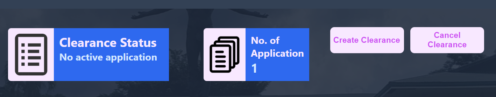
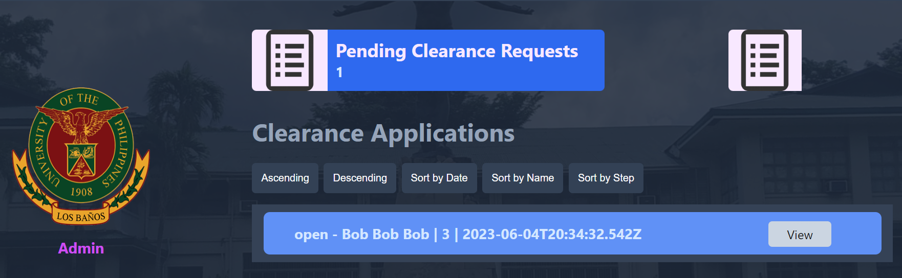

# Clearance Approval Project
A clearance approval web application for the students of Institute of Computer Science.

## GitHub Repository

The GitHub Repository for the project is available here:
https://github.com/CMSC100/project-group2.git

## Features and Usage Guidelines
The whole project is divided into three (3) different types of user, namely the Students, the Approvers, and the Admin.

### Students 
The students are the ones who will be requesting for the clearance application. Their applications must be approved by the approvers and then be cleared by the clearance officer a.k.a admin. 
They can view the current status of their clearance application. They can create/open and close a clearance application.

To be able to request for a clearance the students must follow these steps:
1. Create a request for a student account for the web application, the student must provide the necessary information for a successful request.

2. Wait for the Admin to approve the request for student account.
3. After being approved, the students shall now be able to login and logout and access the students' homepage.
4. Click the Create Clearance button and provide the necessary information such as the GitHub Link and the optional remarks.

5. Wait for the approval of the approver or resubmit and provide the necessary information required by the approver in the remarks sent by the approver when they returned the clearance application.

6. Wait until the clearance officer cleared the clearance application resubmit and provide the necessary information required by the clearance officer in the remarks sent by the clearance officer when they returned the clearance application.

7. Print the PDF file available after the clearance officer cleared the clearance application.

### Approvers
The Approvers are the ones who will first receive the newly created clearance application of the students, They have a list of clearance application and they shall check the GitHub link repository that is submitted by the students then decide whether to approve or return the clearance application with remarks to the students.

Take note that Approvers cannot create an account, they are assigned by the Admin they can login and logout. The Approvers are faculty members of the institute.

### Admin
The Admin is the superuser of the whole web application. There can only be one Admin and it is a built-in account in the web application.

The Admin is the one responsible for the following:
1. Approving or Rejecting the Students' request for a student account.

2. Creating / Editing / Deleting an Approver account.

3. Assigning an Approver to a student.

4. Clearing the request of the students 

## How to Run
In order to run the web application, follow these steps:
1. Pull / Clone the web application in the GitHub Repository presented above.
2. Inside the project-api folder directory, in the terminal, install express by running the command: 

> 
	npm install express --save
3. Inside the group2-project folder directory, in the terminal, install react-scripts and jspdf by running the commands:
> 
	npm install react-scripts --save
	npm install jspdf --save
4. To start the web server, inside the project-api folder directory, in the terminal, run this command:
> 
	node index.js
5. To run the web application, inside the group2-project folder directory, in the terminal, run this command:
> 
	npm start
6. Wait for the web page to open and load.

## Authors

 - Shane Austin Asuncion
 - Jan Eriol Cunanan
 - Ebrahim Gabriel
 - Luis Dominic Laserna
 - Patricia Mae Vargas

## References
Disclaimer! No copyright infringement caption intended, we do not own the any elements on this application, the elements belongs to its rightful owner!

Some owners of the elements we used:
- MinexCoin (https://coinmarketcap.com/currencies/minexcoin/?fbclid=IwAR3PFyk8YNPt8ToXbuPSmF57rXaPssPPBL_D4CC8m88kodIemyz92LWDCGc)
- Daryl Jose Deanon, UPLB Perspective (https://twitter.com/uplbperspective/status/1297398158813802496?s=20&fbclid=IwAR3tyAZ8mqfH-6pKKf7DSZYjlO0y5AKXe0VWuzDbRteucWuCkBLF6btDqjU)